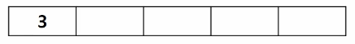
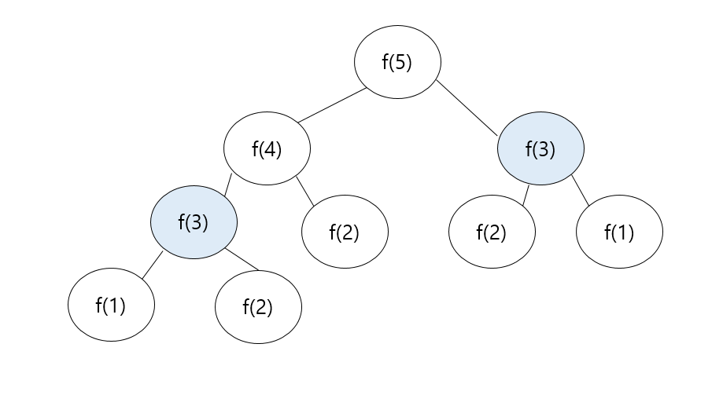
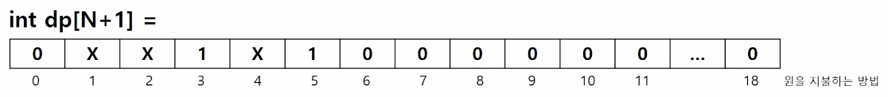
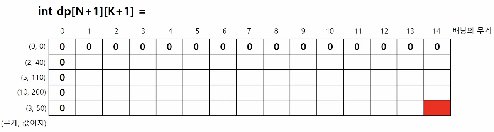
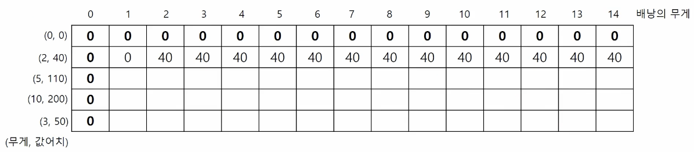
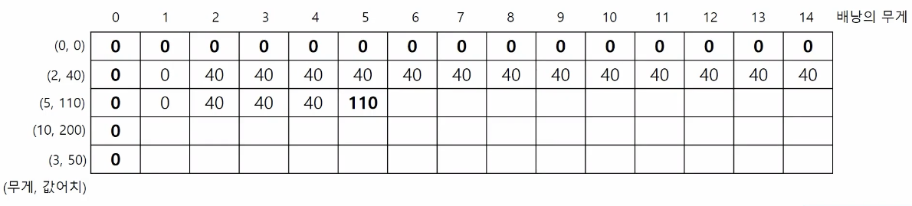
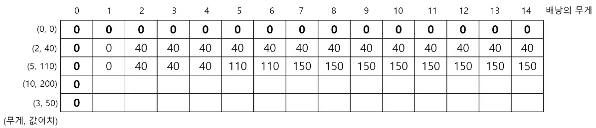
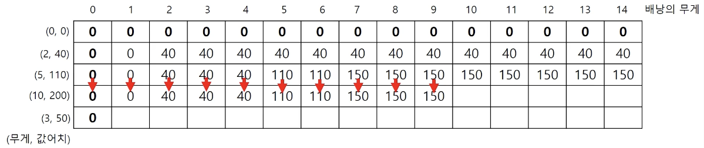
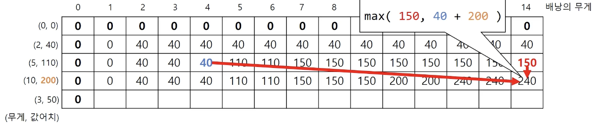
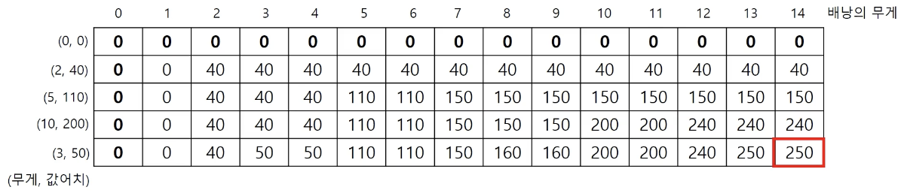

# 1 dynamic programming

**Dynamic programming**(동적 프로그래밍)이란 용어 자체로는 사실 이해하기 어렵다. 어떤 큰 문제를 작은 문제로 나눠서 '분할 정복'한다는 개념으로 이해하면 좋다.

예를 들어서 아래처럼 숫자만으로 나열된 수열은 그 의미를 알기 힘들다. 

$$ 1, 3, 7, 15, 31, 63, \cdots $$

하지만 아래와 같이 초항과 점화식으로 표현하면 그 의미를 알기 쉽게 된다.

$$ a_{1} = 1 $$

$$ a_{n} = 2a_{n-1} + 1 $$

그렇다면 다음 수열을 Top-down, Bottom-up 방식으로 풀어보자.

---

### <span style='background-color: #393E46; color: #F7F7F7'>&nbsp;&nbsp;&nbsp;📝 예제 1.1: 수열을 Top-down, Bottom-up 두 방식으로 풀이&nbsp;&nbsp;&nbsp;</span>

수열의 점화식이 다음과 같을 때, $a_5$ 를 구하여라.

- 초항: $a_1 = 3$

- 점화식: $a_n = 2a_{n-1} - 4$

### <span style='background-color: #C2B2B2; color: #F7F7F7'>&nbsp;&nbsp;&nbsp;🔍 풀이:Top-down&nbsp;&nbsp;&nbsp;</span>

$a_{5} = 2a_{4}-4$

$\quad \, = 2*(2a_{3}-4)-4$

$\quad \, = 2*(2*(2a_{2}-4)-4)-4$

$\quad \, = 2*(2*(2*(2a_{1}-4)-4)-4)-4$

$\quad \, = 2*(2*(2*(2*3-4)-4)-4)-4$

$\quad \, = -12$

### <span style='background-color: #C2B2B2; color: #F7F7F7'>&nbsp;&nbsp;&nbsp;🔍 풀이:Bottom-up&nbsp;&nbsp;&nbsp;</span>

$a_{2} = 2a_{1} - 4 = 2$

$a_{3} = 2a_{2} - 4 = 0$

$a_{4} = 2a_{3} - 4 = -4$

$a_{5} = 2a_{4} - 4 = -12$

> 간단한 문제라면 대체로 편리한 Bottom-up 방식을 쓸 때가 많다.

---

이번에는 array(배열)에서 $a_5$ 를 구하는 예제 1을 구현해 보자. 아래와 같은 array는 다음과 같은 코드로 구현할 수 있다.

```c
int arr[5]    // 자료형 변수명[배열의 길이]
```



사실상 array의 맨 왼쪽에 있는 element가 $a_1$ , 맨 오른쪽에 있는 element가 $a_5$ 인 셈이다.

따라서 점화식에 따라 다음 element는 아래와 같이 생각할 수 있다.

$$ \mathbf{arr}[2] = 2*\mathbf{arr}[1] - 4 $$

이런 구현은 for 반복문을 통해서 가능하다. 문법을 일단 내려두고 직관적으로 구현하면 다음과 같다.

```c
int arr[5] = {3, 0, 0, 0, 0}

for(int i = 2; i<= 5, i++) {
    arr[i] = 2 * arr[i-1] - 4;
}

print(arr[5])
```

---

## 1.1 1차원 array

큰 문제를 작은 문제부터 해결하는 dynamic programming의 1차원 array 문제부터 살펴보자.

---

### <span style='background-color: #393E46; color: #F7F7F7'>&nbsp;&nbsp;&nbsp;📝 예제 1.2: 동전의 최솟값 구하기&nbsp;&nbsp;&nbsp;</span>

3원과 5원 동전이 있다. 최소한의 동전 사용으로 정확하게 N 원을 지불하려고 한다. ( $0 \le N \le 5000$ )

이 때 최소한으로 사용된 동전의 개수를 구하여라. 지불이 불가능하다면 -1을 출력한다. 동전은 모든 경우가 가능할 만큼 충분히 많다고 가정한다.

입력 예시

- N=18 이면 결과값은 4

- N=4 이면 결과값은 -1

- N=6 이면 결과값은 2

### <span style='background-color: #C2B2B2; color: #F7F7F7'>&nbsp;&nbsp;&nbsp;🔍 풀이&nbsp;&nbsp;&nbsp;</span>

이 문제는 문득 보면 '5원짜리를 최대한 쓰고, 나머지에서 3원을 최소한으로 쓴다'는 방법으로 해결할 수 없다. 예를 들어 N=11이라면, 5원을 2개 쓰는 순간 더 이상 11원을 지불할 수 없게 된다.

이 문제를 해결하기 위해서는, 상대적으로 구하기 쉬운 N'과 N''으로 N을 나타내는 점화식을 만들어야 한다.



예를 들어 N=20일 때의 최소한의 사용 $f_{20}$ 은 다음과 같다.(tree 구조를 생각하면 된다.)

- N=15 에서의 최소한의 사용 $f_{15}$ 에서 5원 동전 하나를 더 쓴 것과 같다. 

  - $f_{15}$ 는 마찬가지로 $f_{10}$ + 1, 혹은 $f_{12}$ + 1로 나타낼 수 있다.

- N=17 에서의 최소한의 사용 $f_{17}$ 에서 3원 동전 하나를 더 쓴 것과 같다.

  - $f_{17}$ 는 마찬가지로 $f_{12}$ + 1, 혹은 $f_{14}$ + 1로 나타낼 수 있다.

이 문제를 일반화하면 다음과 같이 표현할 수 있다.

- 초항: $f_{3} = 1, f_{5} = 1$

- 점화식: $f_{n} = \min(f_{n-3}+1, f_{n-5}+1) \quad (n > 5)$

> 또한 문제의 조건에 따라 $f_{1}, f_{2}, f_{4} = -1$ 이 된다.

우선 N=18일 때를 코드로 구현해 보자. array의 이름은 dp로 하겠다.



- array의 크기는 N+1로 한다. array의 index가 0부터 시작하기 때문에, N+1의 크기로 지정해야 dp[N]을 입력했을 때 element를 정확히 N의 최소 지불 개수가 되게 만들 수 있다. 

- 현재는 아직 초항에 해당하는 값만 넣어 주었다. 또한 크게 의미는 없지만 $f_{0} = 0$ 도 넣어 주었다.(자명한 case를 넣어주는 기술. **trivial case**)

```c
int dp[19]
```

초항을 넣었으므로 이제 dp[6]부터 차근차근 채워 나가야 한다. 3원 2개가 된다. 문제를 풀어 나가는 과정은 다음과 같이 진행될 것이다.

- $\mathbf{dp}[6] = 2$

- $\mathbf{dp}[7] = -1$ 

- $\mathbf{dp}[8] = 2$ (5 + 3)

- ...

- $\mathbf{dp}[18] = ?$

> dynamic programming에서 진행한 과정은 '(1) trivial case 채우기 (2) 점화식 만들기 (3) non-trivial case를 앞의 조건들로 채워 나가기'로 진행됐다.

이제 c 언어로 작성한 코드를 보자. 어느 정도 문법을 덜 고려한 형태로 작성했다.

```c
#include <algorithm>
#define X -1

int dp[19] = { 0, X, X, 1, X, 1 };

for (int i = 6; i<=18; i++){
    if(dp[i-3] == X && dp[i-5] == X){
        dp[i] = X;
        continue;
    }
    if(dp[i-3] == X || dp[i-5] == X){
        // max 함수를 쓰는 이유는, 둘 중 하나가 불가능한 경우 -1인 값을 갖기 때문이다.
        dp[i] = max(dp[i-3]+1, dp[i-5]+1);
        continue;
    }
    dp[i] = min( dp[i-3]+1, dp[i-5]+1 );
}

print(dp[18]);
```

> { 0, X, X, 1, X, 1 } 초기화에서, 채워지지 않은 부분(dp[6]부터 dp[18]까지)은 알아서 0으로 초기화가 된 상태로 보면 된다.

- algorithm header: min function 사용을 위해 추가

- define X -1: 문제의 조건에 따라 '지불이 불가능한 경우 X를' -1로 임의로 정의하였다.

그런데 이 분기를 더 줄일 수 있다. 다음 코드를 보자.

```c
#include <algorithm>
#define X 5000

int dp[19] = { 0, X, X, 1, X, 1 };

for (int i = 6; i<=19; i++){
    dp[i] = min( dp[i-3]+1, dp[i-5]+1 );
}

if(dp[18] >= X){
    // ==가 아닌 >=를 쓴 이유는 위 반복문에서 5000보다 큰 값이 만들어지기 때문이다.
    print("-1");
    return 0;
}

print(dp[18])
```

---

## 1.2 2차원 array

큰 문제를 작은 문제부터 해결하는 dynamic programming의 2차원 array 문제를 살펴보자.

---

### <span style='background-color: #393E46; color: #F7F7F7'>&nbsp;&nbsp;&nbsp;📝 예제 1.3: 배낭 채우기&nbsp;&nbsp;&nbsp;</span>

도둑은 보석을 배낭에 담아 훔치려고 한다. 그러나 배낭 무게가 K( $1 \le K \le 10,000$ )를 넘어가면 배낭이 망가지게 된다.

- 보석의 개수는 N 개( $1 \le N \le 1,000$ )로, 각각 값어치와 무게를 가지고 있다.

따라서 어떻게 해야 도둑은 총 무게가 N이 넘지 않으면서 값어치가 최대가 되도록 보석을 담을 수 있을까?

이때 **보석은 각 종류별로 1개씩이라고 가정**한다.

입력 예시는 다음과 같다.

$$ \begin{bmatrix} 4 & 14 \\ 2 & 40 \\ 5 & 110 \\ 10 & 200 \\ 3 & 50 \end{bmatrix} $$

- 첫째 row: 보석의 개수 N=4, 배낭의 무게 한도 K = 14

- 둘째~다섯째 row: 각 보석별 무게 $W_{i}$ , 값어치 $P_{i}$ 

이 경우 결과는 다음과 같다.

- 3번째 보석 1개(무게 10, 값어치 200) + 4번째 보석 1개(무게 3, 값어치 50)으로 250이 된다.


### <span style='background-color: #C2B2B2; color: #F7F7F7'>&nbsp;&nbsp;&nbsp;🔍 풀이&nbsp;&nbsp;&nbsp;</span>

- 보석의 개수 $N$ 과, 배낭의 용량 $K$ 의 조건에 맞춰야 한다.

- 보석은 각각 무게 $W_{i}$ , 값어치 $P_{i}$ 를 갖는다.

기본적으로 떠올릴 만한 요쇼는 가성비, 즉 단위 무게당 값어치일 것이다.

- 1번 보석: 40/2 = 20

- 2번 보석: 110/5 = 22

- 3번 보석: 200/10 = 20

- 4번 보석: 50/3 = 16.6666(약 17)

하지만 앞서 본 입력 예시는 가성비 보석부터 채워서는 최적의 결과를 얻을 수 없었다.

c언어 코드를 보자. 보석의 무게와 값어치를 함께 표시하기 위해 2차원 array로 나타내야 한다. 이름은 dp로 하겠다.



- column: 배낭의 용량 K를 의미

  - 값이 (*,0)일 때: 이는 용량이 0임을 의미하므로 따라서 0이 된다.(**trivial case**)

- row: 각 보석을 의미. 보석은 각각 무게 $W_{i}$ , 값어치 $P_{i}$ 를 갖는다.

  - 값이 (0,*)일 때: 보석이 존재하지 않음을 의미하므로, 배낭 용량에 상관 없이 0이 된다.(**trivial case**)

> 여기서 이 행렬의 의미를 잘 알아야 한다. 2번째 row까지만 있다면, (2, 40)인 보석 하나만 존재하는 것이다. 3번째 row까지 있으면 (5,110), (10, 200)인 보석이 각각 하나씩 존재하는 것이다. 즉 문제에서 구해야 할 최종 목표는 그림의 빨간 영역에 해당하게 된다.

```c
int dp[N+1][K+1]
```

1. 우선 두 번째 행, 즉 (2, 40) 보석 하나만 있는 경우는 배낭의 허용용량이 2가 되는 순간부터 40이 될 것이다.



2. 세 번째 행은 배낭의 허용용량이 5가 되는 시점부터 고려할 필요가 생긴다. 이 경우는 5를 사용하는 방법, 2를 사용하는 방법 중 max인 것이 들어가게 된다.



이를 식으로 표현하면 다음과 같다. <U>(5,110) 보석을 고른 뒤에는</U> 배낭의 무게가 0이 되므로, (2,40)은 있으나 배낭의 무게는 0인 <U>dp[1][0] case가 된다.</U>

다시 말해, (5,110) 보석을 고름 + 여분 dp[1][0] case // dp[1][5] case 중에서 큰 case를 고르면 답이 되는 것이다. 이를 식으로 표현하면 다음과 같다.

- $\max( \mathbf{dp}[i-1][j], \mathbf{dp}[i-1][j - JEWEL\_WEIGHT]+JEWEL\_VALUE)$

  - 지금 case에서는 JEWEL_WEIGHT=5, JEWEL_VALUE는 110이 된다.

  - $= \max( 40, 0 + 110 )$

바로 dp[7][2] 행은 아래 식이 될 것이다.

- $\max( 40, 40 + 110)$



3. 다음 줄은 배낭의 허용용량이 10이 되는 시점부터 고려할 필요가 생긴다.



dp[10][3]은 다음과 같은 점화식이 될 것이다.

- $\max( 150, 0 + 200 )$



4. 이런 과정을 반복하면 최종적으로 원하는 결과를 얻을 수 있다.



이 과정을 c++로 구현할 것이다. global variable을 사용하는 건 권장하지 않지만, 이해를 돕기 위해 사용하여 작성했다.

```c++
#include <iostream>
#include <algorithm>
using namespace std;

int N, K;    // 보석 개수와 배낭 제한 용량
int W[1010]; // 보석별 무게를 저장하는 array
int P[1010]; // 보석별 값어치를 저장하는 array
             // 길이를 조건인 1000으로 주기보다는 어느 정도 여유를 준 1010으로 설정
             // main에서 사용하는 local variable과 구별하는 의미로 대문자로 작성하였음

int DP[1010][10010];    // trivial case까지 1001, 10001이 필요하지만, 어느 정도 여유 공간을 추가한 설정

int main(){
    // 조건을 입력받는다.
    scanf("%d%d", &N, &K);
    for (int i = 1; i <= N; i++){
        scanf("%d %d", &W[i], &P[i]);
    }

    // ---------- 문제 풀이에 필요한 코드 ----------
    // 우선 상단 왼쪽에서 오른쪽으로 진행한 뒤, 아래를 훑는 반복문을 작성
    for (int i = 1; i <= N; i++){
        for (int j = 1; j <= K; j++) {
            // DP[i][j] 관련 점화식(두 종류가 있었다.)
            // 1. 보석을 선택할 수 없을 때 바로 위쪽 cell의 값을 가져온다. 즉, 배낭의 용량에 보석이 들어가지 않는 경우
            if (j < W[i]){
                DP[i][j] = DP[i-1][j];
            } 
            else{    // 2. 배낭에 용량에 보석이 들어가면
                DP[i][j] = max(DP[i - 1][j], DP[i - 1][j - W[i]] + P[i]);
            }
        }

        printf("%d", DP[N][K]);

    }
}
```

- c++은 iostream header를 추가해야 한다.

- using namespace std;: c에서의 stdio.h header와 같다.(사용하지 않더라도 습관적으로 넣어주는 것이 좋다.)

---