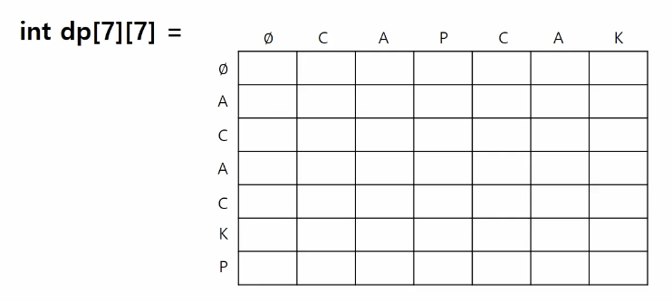
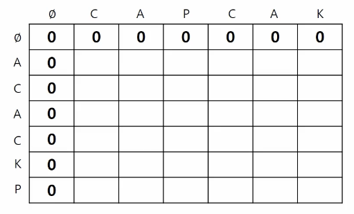
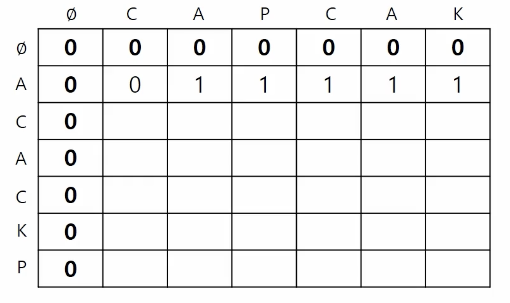
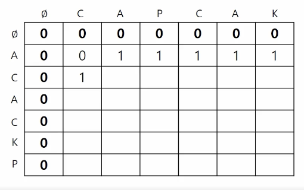
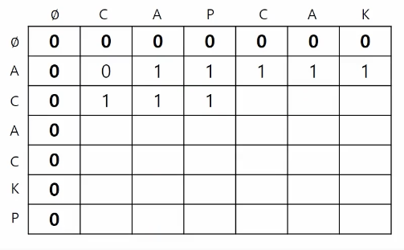
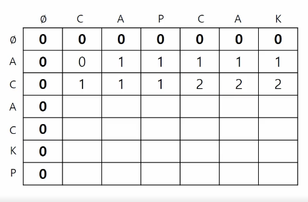
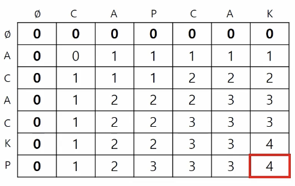

# 2 LCS(Longest Common Subsequence)

dynamic programming에서 2차원 array의 **LCS**(Longest Common Subsequence) 문제를 풀어보자. LCS란 최장 공통/부분 서열을 뜻한다.

- 부분 서열

여기서 부분 서열은 원래 문자열에서 임의의 몇 개의 문자를 선택하여 순서를 유지한 채 새로 만든 문자열을 뜻한다.

> 길이가 0인 문자열이나, 문자열 자기 자신도 부분 문자열에 포함된다.

예를 들어 문자열 "abcde"의 부분 서열은 다음과 같다.

0. $\varnothing$ (empty string)

1. a, b, c, d, e

2. ab, ac, ad, ae, ..., ce, cd

3. ...

4. abcd, ...., acde, bcde

5. abced

- 공통 부분 서열

공통 부분 서열은 문자열 집합 내에서 공통으로 존재하는 부분 문자열을 뜻한다.

예를 들어 문자열 "abcdefg"와 "abejdfk" 두 가지 문자열이 주어진다면 부분 서열은 다음과 같다. (둘 다 길이는 4이다.)

1. abef

2. abdf

> 이는 각각의 문자열이 갖는 부분 서열 중에서 서로 공통되는 것에 해당한다.

---

### <span style='background-color: #393E46; color: #F7F7F7'>&nbsp;&nbsp;&nbsp;📝 예제 2.1: 2개의 문자열에서 LCS의 길이를 구해보기&nbsp;&nbsp;&nbsp;</span>

입력은 문자열 두 개, 즉 두 줄로 구성된다. 문자열의 길이는 1000 이하이며, 알파벳 대문자와 숫자로만 구성되어 있다.

입력 예시는 다음과 같다.

문자열 

- ACACKP

- CAPCAK

출력: 4

### <span style='background-color: #C2B2B2; color: #F7F7F7'>&nbsp;&nbsp;&nbsp;🔍 풀이&nbsp;&nbsp;&nbsp;</span>

앞서 입력 예시로 본 문자열을 코드 관점에서 보자.



- row, column은 입력으로 받은 문자열 각각을 의미한다.

  - (0,0)은 empty string, 즉 $\varnothing$ 을 의미한다.

> 주의할 점은 (0, 1)은 "CAPCAK" 중 "C"만 포함하는 경우, (0, 2)는 "CA", ... (0.7)은 "CAPCAK"를 모두 포함한다는 걸 나타낸다.

> 따라서 원하는 값은 (7,7)에 존재하는 element가 된다.

우선 trivial case를 채우면 다음과 같다.



1. 2번째 row를 보면, 문자열 "A"와 "CAPCAK"의 부분 서열의 비교이므로, column에서 A가 나오게 되는 "CA"부터 고려 대상이 된다.



2. 3번째 row는 문자열 "AC"와 "CAPCAK"의 부분 서열 비교이므로, C가 등장하는 "C"부터 고려하게 된다.



문제는 이 다음부터이다. "AC"와 "CA"의 부분 서열의 비교이다. 이제 문제의 핵심인 점화식이 필요하다.

> 우선 마지막 문자가 서로 다르다면, (\*\*A, \*\*B일 때, MAX_LEN(LCS("\*\*A", "\*\*B"))=2)은 다음과 같게 볼 수 있다. 

> MAX_LEN(LCS("\*\*A", "\*\*")) 혹은 MAX_LEN(LCS("\*\*", "\*\*B"))

> 그리고 이 둘은 MAX_LEN(LCS("\*\*", "\*\*"))와 같거나 더 클 것이다.

결국 dp[2][2]에 해당하는 점화식은 다음과 같다.

- $\max( \mathbf{LEN}(\mathbf{LCS}("AC", "C")), \mathbf{LEN}(\mathbf{LCS}("A", "CA")))$

이를 다시 작성하면 아래와 같다.

- $dp[i][j] = max( dp[i-1][j], dp[i][j-1] )$

따라서 dp[2][2] = 1, dp[2][3]도 마찬가지로 1이 된다.



3. 이제 3번째 row의 "AC"와 "CAPC"는 마지막 문자가 같은 경우에 해당한다. 

이 경우는 굉장히 간단한데, 그냥 "A"와 "CAP"의 LCS에서, 마지막에 C가 붙으면서 길이가 +1될 뿐이다.

- $dp[i][j] = dp[i-1][j-1] + 1$

따라서 dp[4][2]은 2가 된다. row의 나머지는 마지막 문자가 다르므로 2번의 점화식에 따라 2로 채워진다.



4. 위 점화식들을 이용해서 계속해서 풀어나가면 array의 모든 곳을 채울 수 있다.



이를 코드로 구현하면 다음과 같다. 이해를 돕기 위해 굳이 global variable을 사용했다. 문자열은 단순히 s1, s2 변수명으로 작성했다.

> 이런 문제에서 깊이 배열을 **굳이 동적 할당**(int** DP = (int**)malloc(...))**을 이용해서 필요한 만큼만 만들 필요는 없다.** 여러 문제를 방지하기 위해 main 바깥에서 정적 선언으로 넉넉한 크기로 생성한다. 

- string.h: strlen을 사용하기 위해 추가한 header

> c++ 문법으로 정의한 string(std::string str = "hi";)은 string을 쓴다.

```c++
#include <iostream>
#include <algorithm>
#include <string.h>
using namespace std;

// 문자열은 1000 이하이므로, null을 포함한 1001이 되어야 한다. 조금 더 여유를 줘서 1010으로 정의했다.
char s1[1010];
char s2[1010];

// 문자열의 길이를 저장할 변수
int len1;
int len2;

// array에는 trivial case를 위해 1001로 구현해야 하며, 조금 더 여유를 준 1010으로 값을 지정했다.
int DP[1010][1010];

int main(){
    // 만약 동적 할당을 이용했다면 아래와 같이 배열을 만들었을 것이다.
    // int** DP = (int**)malloc(...)
    
    // 0번째 index부터가 아닌 index 1부터 문자열을 받을 것이므로, &s1[1]로 작성한다.
    scanf("%s", &s1[1]);
        // 만약 문자를 하나씩 받고 싶다면 다음과 같이 작성한다.
        // while (){
        //     scanf("%c", s1[i++])
        // }
    scanf("%s", &s2[1]);

    // 문자열 길이 변수에 값을 넣어준다.
    len1 = strlen(&s1[1]);
    len2 = strlen(&s2[1]);

    // ---------- 문제 풀이에 필요한 코드 ----------
    for (int i = 1; i <= len1; i++){
        for (int j = 1; j <= len2; j++){
            // DP[i][j]를 채우기 위한 점화식
            // 마지막 문자가 일치할 때
            if(s1[i] == s2[j]){
                DP[i][j] = DP[i-1][j-1] + 1;
            } 
            else {    // 마지막 문자가 일치하지 않을 때
                DP[i][j] = max(DP[i-1][j], DP[i][j-1]);
            }
        }
    }

    printf("%d", DP[len1][len2]);
}
```

---

